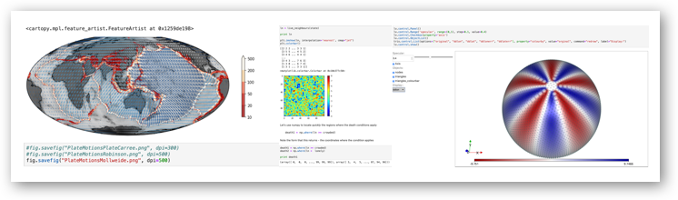

## Advanced Topics in Python for Earth Scientists

(c) Louis Moresi (2015-2019)

A notebook-based introduction to python, jupyter notebooks and programming workflows with examples from python packages for the Earth Sciences.

The material is broken down into a number of sections of, approximately, increasing difficulty.

  1. [Introduction to python / jupyter](Notebooks/Introduction2Python/1-IntroductionToJupyterNotebooks.ipynb)
  1. [Introduction to version control with git](Notebooks/Introduction2VersionControl/1-GettingStartedWithGit.ipynb)
  1. [Getting Started with Numpy / Scipy](Notebooks/Numpy+Scipy/1-IntroductionToNumpy.ipynb)
  1. [Introduction to Matplotlib](Notebooks/Plotting/1-IntroductionToMatplotlib.ipynb)
  1. [Stripy for meshing / mapping the Sphere](Notebooks/SphericalMeshing/SphericalTriangulations/Ex1-Spherical-Triangulations.ipynb)
  1. [Making beautiful and useful maps with Cartopy](Notebooks/Mapping/0-Preliminaries.ipynb)
  1. [Finite Differences with numpy](Notebooks/SolveMathProblems/0-IntroductionToNumericalSolutions.ipynb)

### Description

This course builds upon a basic knowledge of python to develop key expertise in scientific applications of python, particularly for the Earth sciences. We are also going to focus on problem-solving approaches to computation - developing a systematic approach to programming, testing, debugging and documentation. We will make use of git for version control which is a tool / strategy that you will definitely find helpful in future. We will do all of our work within the literate programming environment of jupyter notebooks / jupyter lab.

We will introduce/review the 'standard' scientific python toolkits such as numpy, scipy, matplotlib, pandas. We will teach you how to manipulate and transform data in simple ways, plotting, mapping, visualisation, interpolation, gridding, function fitting, and exporting data / images into common, interchangeable data formats such as hdf5 and netcdf, geotiff ...

We will learn how to orchestrate common earth science python software applications, seismic data set acquisition and analysis (obspy), meshing and interpolation (stripy). We will learn how to solve very simple differential equations with application to geothermal energy and ground water flow, statistical analysis of data sets.
